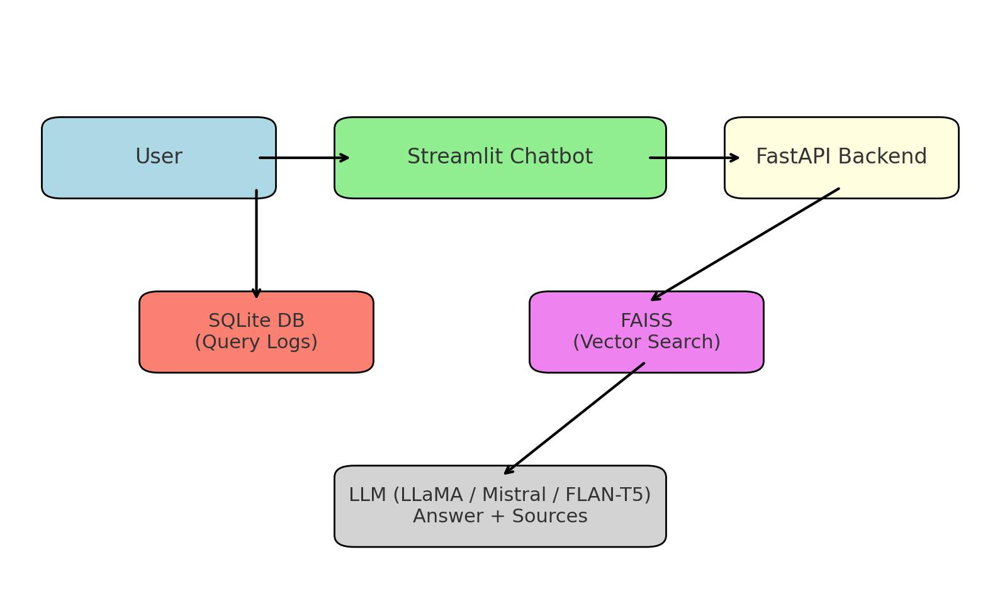

# Enterprise-Grade RAG Assistant — Design Document

## 1. Overview
This document describes the design of the **Enterprise-Grade Retrieval-Augmented Generation (RAG) Assistant**, 
a system that enables employees to query internal enterprise documents and receive 
LLM-powered answers **grounded in verified sources**.

The solution is built entirely with **open-source and free tools** to ensure accessibility 
while demonstrating **production-grade ML system design** for portfolio and interview purposes.

---

## 2. Problem Statement
Enterprises generate large amounts of unstructured data: PDFs, policies, 
Confluence pages, and contracts.  
Traditional keyword search is brittle, time-consuming, and often returns irrelevant results.  

**Goal:** Build a system that retrieves semantically relevant information 
and generates natural language answers with source citations, while ensuring 
**observability, scalability, and cost efficiency**.

---

## 3. Objectives
- ✅ Implement a **cost-free, open-source RAG pipeline**.  
- ✅ Provide a **Streamlit chatbot UI** accessible online.  
- ✅ Log queries and user feedback for observability.  
- ✅ Demonstrate **system-level thinking** (scalability, monitoring, deployment).  

---

## 4. System Architecture

**Key Components:**
1. **Document Ingestion**
    - Parses PDFs, Word, or Confluence using `unstructured` + `PyMuPDF`.
    - Cleans and chunks text for embeddings.

2. **Embeddings + Vector Store**
    - Hugging Face model: `all-MiniLM-L6-v2` (free, lightweight).
    - FAISS vector database for efficient similarity search.

3. **Retriever Pipeline**
    - Retrieves top-k chunks relevant to user query.
    - Augments query with context for LLM prompt.

4. **LLM Service**
    - Default: Hugging Face `flan-t5-small` (fast, free).
    - Option: Quantized LLaMA/Mistral for higher quality answers.

5. **Observability**
    - Logs queries, retrieved docs, and answers in **SQLite**.
    - Collects user feedback (thumbs up/down).

6. **Frontend**
    - Streamlit chatbot hosted on **Streamlit Cloud (free)**.
    - Shows answers + sources in a clean UI.

---

## 5. Technology Choices
| Component        | Choice                              | Rationale                              |
|------------------|-------------------------------------|-----------------------------------------|
| Ingestion        | unstructured, PyMuPDF               | Free, flexible document parsing          |
| Embeddings       | Hugging Face MiniLM                 | Lightweight, free, CPU-friendly          |
| Vector DB        | FAISS (local)                       | Free, scalable, widely adopted           |
| LLM              | flan-t5-small / LLaMA quantized     | Free inference, no API bills             |
| Backend          | FastAPI                             | Lightweight REST service                 |
| Frontend         | Streamlit                           | Free cloud deployment                    |
| DB               | SQLite (local)                      | Simple logging without infra costs        |
| Deployment       | Streamlit Cloud, Docker (optional)  | Free and easy to share                   |

---

## 6. Evaluation Metrics
- **Retrieval Quality**: Precision@k, Recall@k.
- **LLM Answer Quality**: Accuracy vs ground truth (small Q&A set).
- **System Performance**: Latency (ms), throughput (queries/sec).
- **User Metrics**: Feedback ratio (👍 vs 👎).

---

## 7. Risks & Mitigations
| Risk                            | Mitigation                                    |
|---------------------------------|-----------------------------------------------|
| LLM inference too slow on CPU   | Use quantized models (`GGUF` with llama.cpp)   |
| Memory limits on Streamlit Cloud| Limit FAISS index size, chunk intelligently    |
| Poor retrieval on noisy docs    | Add preprocessing and chunk overlap            |
| Lack of evaluation framework    | Create synthetic Q&A benchmarks                |

---

## 8. Future Enhancements
- 🔐 Add **role-based access control** for sensitive docs.
- 📈 Build an **analytics dashboard** (usage trends, drift).
- ☁️ Scale out with managed vector DB (Weaviate/Chroma cloud).
- 🛡 Add **compliance filters** (PII masking, GDPR rules).

---

## 9. Portfolio Value
This project demonstrates:
- **End-to-end ML system design** (data → embeddings → retrieval → generation).
- **Cost-conscious engineering** (built entirely free).
- **Production-grade patterns** (logging, feedback loops, observability).
- **Hands-on GenAI deployment** (RAG with open-source LLMs).

